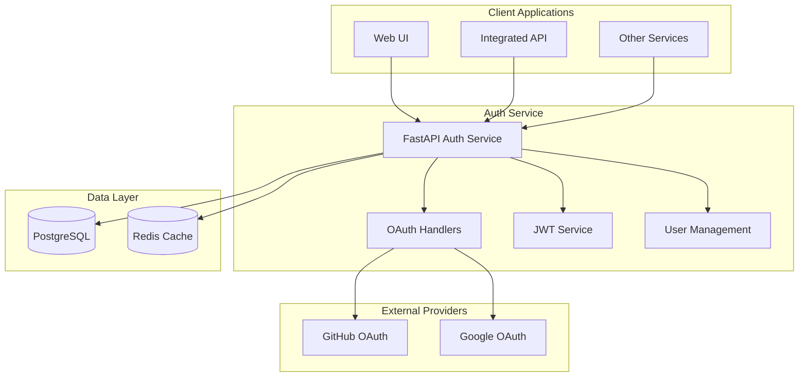

# Docker Atrium Auth Service

A production-ready, centralized OAuth 2.0 / OpenID Connect authentication service.

[]()
[]()
[]()

## 🚀 Overview

This service provides enterprise-grade authentication and authorization, featuring OAuth integration, JWT token management, and comprehensive user permissions.

### Key Features

- **🔐 Multi-Provider OAuth 2.0 / OpenID Connect**
  - GitHub OAuth integration
  - Google OAuth integration
  - Extensible provider architecture
  
- **🎟️ JWT Token Management**
  - Access tokens (configurable expiry, default 30 minutes)
  - Refresh tokens (configurable expiry, default 7 days)
  - Secure token revocation and blacklisting
  
- **👥 User Management**
  - Comprehensive user profiles
  - Role-based access control (RBAC)
  - Service-specific permissions
  - Admin management capabilities
  
- **🛡️ Security Features**
  - CSRF protection with state validation
  - Redis-based session management
  - Secure password handling (bcrypt)
  - CORS configuration
  - Rate limiting protection
  
- **🔧 Operational Features**
  - Health monitoring endpoints
  - Comprehensive logging
  - Database migrations (Alembic)
  - Testing framework (39 tests)
  - Docker containerization

## 🏗️ Architecture



## 🚀 Quick Start

### Prerequisites

- Docker and Docker Compose
- OAuth applications configured with GitHub/Google
- 4GB+ RAM recommended

### 1. Clone and Setup

```bash
git clone https://github.com/tecteluy/docker-atrium-auth.git
cd docker-atrium-auth
cp .env.example .env
```

### 2. Configure Environment

Edit `.env` file with your OAuth credentials:

```bash
# Generate secure secrets
openssl rand -hex 32  # For JWT_SECRET_KEY
openssl rand -hex 16  # For database passwords

# Configure OAuth providers (see OAuth Setup section)
GITHUB_CLIENT_ID=your_github_client_id
GITHUB_CLIENT_SECRET=your_github_client_secret
GOOGLE_CLIENT_ID=your_google_client_id
GOOGLE_CLIENT_SECRET=your_google_client_secret
```

### 3. Start Services

```bash
# Development
docker-compose up -d --build

# Production
ENVIRONMENT=production docker-compose up -d --build
```

### 4. Verify Installation

```bash
# Health check
curl http://localhost:8008/health
# Expected: {"status":"healthy"}

# API documentation
open http://localhost:8008/docs
```

## 🔑 OAuth Provider Setup

### GitHub OAuth Application

1. **Create OAuth App**:
   - Go to [GitHub Developer Settings](https://github.com/settings/developers)
   - Click "New OAuth App"
   - Fill in details:
     - **Application name**: `Atrium Authentication`
     - **Homepage URL**: `http://localhost:3000` (dev) or your domain (prod)
     - **Authorization callback URL**: `http://localhost:8008/auth/callback/github`

2. **Configure Environment**:
```bash
GITHUB_CLIENT_ID=your_client_id_here
GITHUB_CLIENT_SECRET=your_client_secret_here
```

### Google OAuth Application

1. **Create Project**:
   - Go to [Google Cloud Console](https://console.cloud.google.com/)
   - Create new project or select existing
   - Enable Google+ API

2. **Create OAuth Credentials**:
   - Go to "Credentials" → "Create Credentials" → "OAuth 2.0 Client ID"
   - Application type: "Web application"
   - Authorized redirect URIs: `http://localhost:8008/auth/callback/google`

3. **Configure Environment**:
```bash
GOOGLE_CLIENT_ID=your_client_id_here
GOOGLE_CLIENT_SECRET=your_client_secret_here
```

## 🔧 Configuration

### Environment Variables

| Variable | Description | Example | Required |
|----------|-------------|---------|----------|
| `GITHUB_CLIENT_ID` | GitHub OAuth client ID | `abc123...` | ✅ |
| `GITHUB_CLIENT_SECRET` | GitHub OAuth client secret | `secret123...` | ✅ |
| `GOOGLE_CLIENT_ID` | Google OAuth client ID | `123.apps.googleusercontent.com` | ✅ |
| `GOOGLE_CLIENT_SECRET` | Google OAuth client secret | `secret123...` | ✅ |
| `JWT_SECRET_KEY` | JWT signing key (32+ chars) | `openssl rand -hex 32` | ✅ |
| `JWT_ALGORITHM` | JWT algorithm | `HS256` | No |
| `JWT_ACCESS_TOKEN_EXPIRE_MINUTES` | Access token expiry | `30` | No |
| `JWT_REFRESH_TOKEN_EXPIRE_DAYS` | Refresh token expiry | `7` | No |
| `POSTGRES_USER` | Database username | `atrium_auth` | ✅ |
| `POSTGRES_PASSWORD` | Database password | Strong password | ✅ |
| `POSTGRES_DB` | Database name | `atrium_auth` | ✅ |
| `REDIS_PASSWORD` | Redis password | Strong password | ✅ |
| `FRONTEND_URL` | Frontend application URL | `http://localhost:3000` | ✅ |
| `BACKEND_URL` | Backend service URL | `http://localhost:8008` | ✅ |
| `API_TOKEN` | Internal API token | Strong token | ✅ |
| `ENVIRONMENT` | Environment mode | `production` | No |

### Security Configuration

For production deployments, ensure:

```bash
# Strong JWT secret (32+ characters)
JWT_SECRET_KEY=$(openssl rand -hex 32)

# Strong database passwords
POSTGRES_PASSWORD=$(openssl rand -hex 16)
REDIS_PASSWORD=$(openssl rand -hex 16)

# Strong API token
API_TOKEN=$(openssl rand -hex 16)

# Production environment
ENVIRONMENT=production

# HTTPS URLs for production
FRONTEND_URL=https://your-domain.com
BACKEND_URL=https://auth.your-domain.com
```

## 📋 API Reference

### Authentication Endpoints

#### POST `/auth/login/{provider}`
Initiate OAuth login flow.

**Parameters:**
- `provider`: `github` or `google`

**Response:**
```json
{
  "auth_url": "https://github.com/login/oauth/authorize?...",
  "state": "csrf_token"
}
```

#### GET `/auth/callback/{provider}`
Handle OAuth callback.

**Parameters:**
- `provider`: `github` or `google`
- `code`: OAuth authorization code
- `state`: CSRF token

**Response:**
```json
{
  "user": {
    "id": 1,
    "email": "user@example.com",
    "username": "user",
    "full_name": "User Name",
    "avatar_url": "https://...",
    "is_admin": false,
    "permissions": {"services": []}
  },
  "access_token": "eyJ...",
  "refresh_token": "abc...",
  "token_type": "bearer",
  "expires_in": 1800
}
```

#### POST `/auth/refresh`
Refresh access token.

**Request:**
```json
{
  "refresh_token": "abc..."
}
```

**Response:**
```json
{
  "access_token": "eyJ...",
  "token_type": "bearer",
  "expires_in": 1800
}
```

#### POST `/auth/logout`
Logout and revoke refresh token.

**Request:**
```json
{
  "refresh_token": "abc..."
}
```

#### GET `/auth/me`
Get current user information.

**Headers:**
```
Authorization: Bearer eyJ...
```

**Response:**
```json
{
  "id": 1,
  "email": "user@example.com",
  "username": "user",
  "full_name": "User Name",
  "avatar_url": "https://...",
  "is_admin": false,
  "permissions": {"services": []}
}
```

### Health Endpoints

#### GET `/health`
Service health check.

**Response:**
```json
{
  "status": "healthy"
}
```

#### GET `/`
Service information.

**Response:**
```json
{
  "message": "Atrium Authentication Service"
}
```

## 🔗 Integration Guide

### Frontend Integration (React/Next.js)

```javascript
// auth.js
const AUTH_API_URL = process.env.NEXT_PUBLIC_AUTH_API_URL || 'http://localhost:8008';

export const authService = {
  // Initiate login
  async login(provider) {
    const response = await fetch(`${AUTH_API_URL}/auth/login/${provider}`);
    const { auth_url } = await response.json();
    window.location.href = auth_url;
  },

  // Handle callback
  async handleCallback(provider, code, state) {
    const response = await fetch(
      `${AUTH_API_URL}/auth/callback/${provider}?code=${code}&state=${state}`
    );
    return await response.json();
  },

  // Refresh token
  async refreshToken(refreshToken) {
    const response = await fetch(`${AUTH_API_URL}/auth/refresh`, {
      method: 'POST',
      headers: { 'Content-Type': 'application/json' },
      body: JSON.stringify({ refresh_token: refreshToken })
    });
    return await response.json();
  },

  // Get current user
  async getCurrentUser(accessToken) {
    const response = await fetch(`${AUTH_API_URL}/auth/me`, {
      headers: { Authorization: `Bearer ${accessToken}` }
    });
    return await response.json();
  }
};
```

### Backend Integration (FastAPI)

```python
# auth_middleware.py
import httpx
from fastapi import Depends, HTTPException, Header
from typing import Optional

AUTH_SERVICE_URL = "http://auth-service:8000"

class AuthService:
    @staticmethod
    async def verify_token(authorization: str = Header(...)) -> dict:
        """Verify JWT token with auth service."""
        if not authorization.startswith("Bearer "):
            raise HTTPException(status_code=401, detail="Invalid authorization header")
        
        token = authorization.replace("Bearer ", "")
        
        async with httpx.AsyncClient() as client:
            try:
                response = await client.get(
                    f"{AUTH_SERVICE_URL}/auth/me",
                    headers={"Authorization": f"Bearer {token}"},
                    timeout=5.0
                )
                
                if response.status_code == 200:
                    return response.json()
                else:
                    raise HTTPException(status_code=401, detail="Invalid token")
                    
            except httpx.TimeoutException:
                raise HTTPException(status_code=503, detail="Auth service unavailable")
            except Exception:
                raise HTTPException(status_code=401, detail="Token verification failed")

# Usage in FastAPI routes
@app.get("/protected")
async def protected_route(user: dict = Depends(AuthService.verify_token)):
    return {"message": f"Hello {user['username']}!"}

@app.get("/admin-only")
async def admin_route(user: dict = Depends(AuthService.verify_token)):
    if not user.get("is_admin"):
        raise HTTPException(status_code=403, detail="Admin access required")
    return {"message": "Admin access granted"}
```

### Docker Integration

```yaml
# docker-compose.yml
version: '3.8'

services:
  your-service:
    build: .
    environment:
      - AUTH_SERVICE_URL=http://auth-service:8000
    networks:
      - atrium-network

networks:
  atrium-network:
    external: true
    name: atrium-auth-network
```

## 🧪 Testing

### Running Tests

```bash
# Run all tests
docker-compose --profile test up --abort-on-container-exit

# Run specific test categories
docker-compose exec auth-service pytest tests/unit/ -v
docker-compose exec auth-service pytest tests/integration/ -v

# Run with coverage
docker-compose exec auth-service pytest --cov=app --cov-report=html tests/
```

### Test Categories

- **Unit Tests**: Service logic, token handling, OAuth flows
- **Integration Tests**: Database operations, API endpoints
- **E2E Tests**: Complete authentication flows

### Test Results
```
============================= test session starts ==============================
collected 39 items

tests/integration/test_auth_endpoints.py .............. [ 35%]
tests/integration/test_database_integration.py ...... [ 51%]
tests/integration/test_health.py ........ [ 64%]
tests/unit/test_auth_middleware.py .......... [ 89%]
tests/unit/test_auth_service.py .... [ 94%]
tests/unit/test_oauth_service.py .... [ 97%]
tests/unit/test_token_service.py .... [100%]

======================== 39 passed in 0.43s ========================
```

## 🚀 Development

### Local Development Setup

1. **Install dependencies**:
```bash
cd auth-service
python -m venv venv
source venv/bin/activate  # Linux/Mac
# or
venv\Scripts\activate     # Windows

pip install -r requirements.txt
```

2. **Start database services**:
```bash
docker-compose up auth-db auth-redis -d
```

3. **Run service locally**:
```bash
export POSTGRES_HOST=localhost
export REDIS_URL=redis://localhost:6379/0
uvicorn app.main:app --reload --host 0.0.0.0 --port 8000
```

### Database Migrations

```bash
# Initialize Alembic (first time only)
docker-compose exec auth-service alembic init migrations

# Generate migration
docker-compose exec auth-service alembic revision --autogenerate -m "Description"

# Apply migrations
docker-compose exec auth-service alembic upgrade head

# Rollback
docker-compose exec auth-service alembic downgrade -1
```

### Code Quality

```bash
# Format code
docker-compose exec auth-service black app/
docker-compose exec auth-service isort app/

# Lint code
docker-compose exec auth-service flake8 app/
docker-compose exec auth-service mypy app/

# Security scan
docker-compose exec auth-service bandit -r app/
```

## 🏭 Production Deployment

### Pre-deployment Checklist

- [ ] OAuth applications configured with production URLs
- [ ] Strong passwords and secrets generated
- [ ] Environment variables configured
- [ ] Database backups configured
- [ ] Monitoring and logging configured
- [ ] SSL/TLS certificates configured
- [ ] Firewall rules configured

### Production Environment

```bash
# docker-compose.prod.yml
version: '3.8'

services:
  auth-service:
    build: 
      context: ./auth-service
      target: production
    environment:
      - ENVIRONMENT=production
    restart: unless-stopped
    healthcheck:
      test: ["CMD", "curl", "-f", "http://localhost:8000/health"]
      interval: 30s
      timeout: 10s
      retries: 3
    
  auth-db:
    image: postgres:15
    environment:
      - POSTGRES_PASSWORD_FILE=/run/secrets/postgres_password
    secrets:
      - postgres_password
    volumes:
      - auth_postgres_data:/var/lib/postgresql/data
    restart: unless-stopped

secrets:
  postgres_password:
    file: ./secrets/postgres_password.txt
```

### Deployment Commands

```bash
# Production deployment
docker-compose -f docker-compose.yml -f docker-compose.prod.yml up -d --build

# Update service
docker-compose pull auth-service
docker-compose up -d auth-service

# Backup database
docker-compose exec auth-db pg_dump -U atrium_auth atrium_auth > backup.sql
```

### Monitoring

```bash
# Health monitoring
curl -f http://localhost:8008/health || echo "Service unhealthy"

# Logs monitoring
docker-compose logs auth-service -f

# Performance monitoring
docker stats auth-service auth-db auth-redis
```

## 🔒 Security Best Practices

### Authentication Security

1. **Strong Secrets**: Use cryptographically strong secrets (32+ characters)
2. **Token Expiry**: Keep access tokens short-lived (15-30 minutes)
3. **Refresh Rotation**: Implement refresh token rotation
4. **Rate Limiting**: Implement rate limiting on auth endpoints
5. **HTTPS Only**: Use HTTPS in production

### Database Security

1. **Strong Passwords**: Use strong, unique database passwords
2. **Network Isolation**: Run databases in isolated networks
3. **Backup Encryption**: Encrypt database backups
4. **Access Control**: Limit database access to auth service only

### OAuth Security

1. **State Validation**: Always validate OAuth state parameter
2. **Callback URL Validation**: Use exact callback URL matching
3. **Scope Limitation**: Request minimal necessary OAuth scopes
4. **Token Storage**: Store tokens securely on client side

### Operational Security

1. **Secret Management**: Use secret management tools in production
2. **Audit Logging**: Log all authentication events
3. **Monitoring**: Monitor for suspicious activities
4. **Updates**: Keep dependencies updated

## 🐛 Troubleshooting

### Common Issues

#### OAuth Redirect Mismatch
```
Error: redirect_uri_mismatch
```
**Solution**: Ensure callback URLs in OAuth app match exactly with environment configuration.

#### Database Connection Failed
```
Error: could not connect to server
```
**Solution**: 
1. Check database service is running: `docker-compose ps`
2. Verify environment variables
3. Check network connectivity

#### JWT Token Invalid
```
Error: Invalid authentication credentials
```
**Solution**:
1. Check JWT secret key consistency
2. Verify token hasn't expired
3. Check token format

#### Redis Connection Failed
```
Error: Redis connection failed
```
**Solution**:
1. Verify Redis service is running
2. Check Redis URL configuration
3. Verify Redis password if configured

### Debugging

```bash
# Check service logs
docker-compose logs auth-service

# Check database logs
docker-compose logs auth-db

# Check Redis logs
docker-compose logs auth-redis

# Test connectivity
docker-compose exec auth-service ping auth-db
docker-compose exec auth-service ping auth-redis

# Verify environment
docker-compose exec auth-service env | grep -E "(POSTGRES|REDIS|JWT)"
```

## 📈 Performance Optimization

### Database Optimization

```sql
-- Recommended indexes
CREATE INDEX CONCURRENTLY idx_users_provider_id ON users(provider, provider_id);
CREATE INDEX CONCURRENTLY idx_refresh_tokens_hash ON refresh_tokens(token_hash);
CREATE INDEX CONCURRENTLY idx_refresh_tokens_user_id ON refresh_tokens(user_id);
```

### Redis Optimization

```bash
# Redis configuration
redis-cli CONFIG SET maxmemory 256mb
redis-cli CONFIG SET maxmemory-policy allkeys-lru
```

### Application Optimization

1. **Connection Pooling**: Configure optimal database connection pool size
2. **Caching**: Cache user data in Redis
3. **Token Validation**: Cache JWT validation results
4. **Async Operations**: Use async/await for I/O operations

## 🤝 Contributing

1. **Fork Repository**: Create your own fork
2. **Create Branch**: `git checkout -b feature/your-feature`
3. **Follow Standards**: 
   - Use black for formatting
   - Write tests for new features
   - Update documentation
4. **Test Changes**: Run full test suite
5. **Submit PR**: Create pull request with clear description

### Development Guidelines

- Follow PEP 8 style guidelines
- Write comprehensive tests
- Document all public functions
- Use type hints
- Keep functions focused and small

## 📄 License

This project is licensed under the GNU General Public License v3.0 - see the [LICENSE](LICENSE) file for details.

## 📞 Support

- **Issues**: [GitHub Issues](https://github.com/tecteluy/docker-atrium-auth/issues)
- **Discussions**: [GitHub Discussions](https://github.com/tecteluy/docker-atrium-auth/discussions)
- **Documentation**: This README and inline code documentation
- **Security Issues**: Report privately to security@tectel.com.uy

## 🔄 Changelog

### Version 1.0.0 (Current)
- ✅ OAuth 2.0 integration (GitHub, Google)
- ✅ JWT token management
- ✅ User management and permissions
- ✅ Redis session storage
- ✅ Comprehensive testing (39 tests)
- ✅ Docker containerization
- ✅ Health monitoring

### Roadmap
- 🔄 Database migrations (Alembic)
- 🔄 Rate limiting
- 🔄 Audit logging
- 🔄 Additional OAuth providers
- 🔄 Multi-factor authentication
- 🔄 Session management UI

---

**Made with ❤️ Have a lot of fun...**
